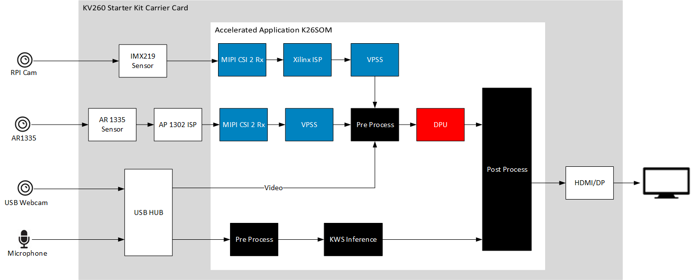

<h1 align="center">NLP SMARTVISION APPLICATION </h1>

## Introduction
This repository contains source code of Kria SOM NLP Smartvision accelerated application. 

 The natural language processing (NLP) SmartVision implements keyword spotting (KWS) on processing system (PS) 
 and face detection, objectdetect, platedetect running on programmable logic (PL). 
 It showcases keyword based dynamic switching between multiple tasks and modifying display properties.

 <div align="center">
  
</div>
 
 For more details refer [NLP Smartvision Landing Page](https://xilinx.github.io/kria-apps-docs/kv260/2022.1/build/html/docs/nlp-smartvision/nlp_smartvision_landing.html)

## Setting up the Board and Application Deployment
A step by step tutorial and details on how to setup the board and run this application is given in the [NLP SmartVision Documentation](https://xilinx.github.io/kria-apps-docs/kv260/2022.1/build/html/docs/nlp-smartvision/docs/app_deployment_nlp.html). Please visit the documentation page for more details.

## License

````
Copyright 2022 Xilinx Inc.
Licensed under the Apache License, Version 2.0 (the "License");
you may not use this file except in compliance with the License.
You may obtain a copy of the License at

    http://www.apache.org/licenses/LICENSE-2.0

Unless required by applicable law or agreed to in writing, software
distributed under the License is distributed on an "AS IS" BASIS,
WITHOUT WARRANTIES OR CONDITIONS OF ANY KIND, either express or implied.
See the License for the specific language governing permissions and
limitations under the License.
````